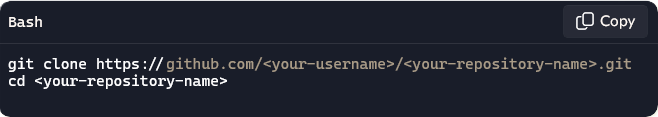
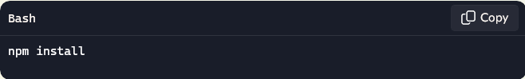
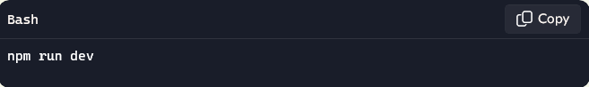
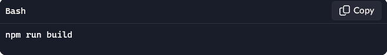

# React Portfolio Project

This project is a personal portfolio built using **React** and **Vite**. It showcases my work, technical skills, and projects I have developed. The portfolio includes hover effects, direct links to live applications, GitHub repositories, and more.

# Description

This project is a **React-based portfolio website** designed to showcase my work, skills, and professional journey. Built with **Vite** for fast development and optimized performance, the portfolio features an interactive project grid, downloadable resume, and responsive design for accessibility across devices. Deployed on **Netlify**, the site is a live and dynamic way to highlight my accomplishments and share my story with potential collaborators and employers.

# Table of Contents

1. Description

2. Features

3. Technologies

4. Installation and Setup

5. Build and Deployment

6. Projects Displayed

7. Live Demo

8. React + Vite

9. Expanding the ESLint configuration

10. License

# Features

* **Interactive Portfolio Grid**: Displays projects with titles, technologies used, and thumbnail previews.

* **Hover Effects**: GitHub icons and links appear when hovering over project thumbnails.

* **Responsive Design**: Ensures the portfolio is accessible across devices of all sizes.

* **Downloadable Resume**: Includes an embedded and linked resume in PDF format.

* **Deployed with Netlify**: Accessible online for sharing and showcasing.

# Technologies Used

* **React**: For building the UI components.

* **Vite**: As the development and build tool.

* **CSS**: Custom styling for responsiveness and hover effects.

* **Netlify**: Pages: For deployment.

# Installation and Setup
Follow these steps to run the project locally:

1. **Clone the Repository**

2. **Install Dependencies**
 
Ensure Node.js and npm are installed, then run:

3. **Run the Development Server**

Start the project locally using:

 
# Build and Deployment

1. **Build for Production**

Before deploying, ensure that the project is built for production:

2. Deploy to Netlify
   
**Option 1: Drag and Drop**

* login to Netlify or create a free account if you don't have one.
  
* In the Netlify dashboard, click on **Add New Site > Deploy manually**.

* Drag and drop the <dist> folder into the upload area.

* Netlify will automatically deploy your site and provide you with a live URL.

**Option 2: Connect to GitHub**

* In the Netlify dashboard, click **Add New Site > Import an existing project**.

* Connect your GitHub account and select your repository.

* Configure the deployment settings:

   * **Build Command**: <npm run build>

   * **Publish Directory**: <dist> 

* Click **Deploy Site**, and Netlify will build and deploy your project directly from your repository.

3. **Set Up a Custom Domain (Optional)**

* Netlify automatically provides a default URL (e.g., https://your-site-name.netlify.app).

* To use a custom domain, go to the Domain Settings in your Netlify dashboard and follow the instructions to connect your domain.  

5. **Test Your Deployment**

* Open the live URL provided by Netlify.

* Ensure that the app works as expected and that all assets (CSS, images, etc.) load properly.
  
# Projects Displayed

1. Odin Recipes

2. Word Scramble

3. Prework Study Guide

4. ReadMeGenie

5. VroomVroom-VehicleVault

6. WorkWarden

# Live Demo

Check out the live version of the portfolio deployed on Netlify:

[resplendent-cucurucho-fe4678.netlify.app](https://resplendent-cucurucho-fe4678.netlify.app/)

# React + Vite

This template provides a minimal setup to get React working in Vite with HMR and some ESLint rules.

Currently, two official plugins are available:

- [@vitejs/plugin-react](https://github.com/vitejs/vite-plugin-react/blob/main/packages/plugin-react/README.md) uses [Babel](https://babeljs.io/) for Fast Refresh
- [@vitejs/plugin-react-swc](https://github.com/vitejs/vite-plugin-react-swc) uses [SWC](https://swc.rs/) for Fast Refresh

## Expanding the ESLint configuration

If you are developing a production application, we recommend using TypeScript and enable type-aware lint rules. Check out the [TS template](https://github.com/vitejs/vite/tree/main/packages/create-vite/template-react-ts) to integrate TypeScript and [`typescript-eslint`](https://typescript-eslint.io) in your project.

# License

This project is open-source and available under the MIT License.

